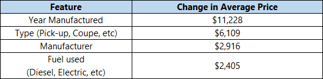
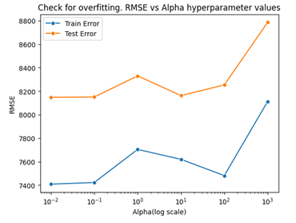

# Cal Machine Learning Course: Practical Application 2: What drives the price of a car?

_By Brad Brown_

# Executive summary
*(Note: Instructions to run the project's ipython notebooks are at the end of this README file)*

## Goal
From a business perspective, we were tasked with identifying key drivers of used car prices. 

### Business Understanding
Background: Used car sales dealerships want to fine tune their inventory to improve profits. Their strategy is to identify what factors make a car more or less expensive. Implicit in this strategy is understanding profit margin and return on investment, not just selling more and higher priced vehicles. However, the focus of this study is on understanding what features in a car customers value. We make the assumption that customers express this 'value' by paying a higher price for cars with more valuable features versus those with less valuable features.

## How we achieve the goal:
We identify the car features in the data that have the strongest relationship with selling price. We rank the most significant to least significant. 

We used "Change in Error by Feature": Differences in mean squared error for hundreds of repeated linear regression model runs using different subsets of features.

We created a model to predict the average price of used cars based on key features.  We found the root mean squared error of the best performing parameterized linear regression model to be able to predict price based on these features.

We checked to avoid overfitting by calculating and analyzing the difference in training error vs validation error across multiple hyper parameters.

Note: Our result at this stage is a correlation study, not a causal study or experiment.

## Why it matters

Traditional used car dealers face important choices in stocking their inventory of used cars. Most traditional business models require car dealers to make capital outlays to purchase inventory (e.g., cars). If they purchase cars that don't sell for high prices or take a long time to sell at a good price, then they become less profitable, and potentially lose money. Choosing the right vehicles to sell is a critical business decision. Even if they are a broker-based business models, they need to know which products to emphasize in marketing to potential customers. 

Therefore, **this project begins to give dealers an effective tools and information to drive inventory decisions.** 

## Findings Summary
- The car features in the data that have the strongest relationship with selling price are:
1) Year Manufactured
2) Type (Pick-up, Coupe, etc)
3) Fuel used (Diesel, Electric, etc)

- Root Mean Squared Error is a way to measure the error of the model when we take what we trained and try it on data it hasn't yet seen. The term represents error conceptually. Data scientists like to 'square' the error to make it always positive (e.g, -2 X -2 = 4) and then take the square root of that, e.g., 2.

- A way to figure out what feature (like 'manufacturer') is important in a model is to run the model without that feature and measure the change in accuracy. As you can see from the "Change in Error by Feature" chart, the differences in mean squared error exemplify these relationships.

- We found the root mean squared error of the best performing model, called a linear regression model, was $7,321. The model predicts price based on the above features. This translates to price prediction accurate within 62%, based on the training test data sets available. While this accuracy is not excellent, the goal is to identify factors that affect price, which the chart above shows we accomplish.

- 'Overfit' is when we teach the model to follow too closely to the training data it see and then it can't do well when it sees new data. So we have ways to check if this has happened. We keep separate data sets outside of the training process, called validation and test sets. 
These results were vetting against potential overfitting by calculating and analyzing the difference in training error vs validation error for the main hyperparameters of the model, alpha. Alpha is just a parameter that helps us control how important important each feature is to the model.
An example of one of these fit tests that we did for New York is below:

The orange test error is a distinct path and consistent trend versus the blue training error.

- Surprisingly, the analysis of the field of the data set entitled 'model' seems to suggest that the model specifics of the car are not a strong driver of price, relative to the other features. We will discuss this result further in the future work section, including more detail on how this project attempted to leverage available model data, and what steps we can do in the future to improve to lower the error and identify more fine-grained factors that correlate to the price of the car.

Note: Our result at this stage is a correlation study, not a causal study or experiment (which is one of our recommendations)

## Conclusions:

- Given that Year Manufactured, Type, Manufacturer and Fuel Used relate higher car prices, used car dealership owners should try looking for cars with these characteristics. Specifically
- More recent years from current date (or years before 1955 although these are rare)
- Vehicle types such as Pick-up Trucks and Coupes
- Fuel types such as Diesel and Electric
- Manufacturers like Tesla, Rover, RAM and Aston Martin, though our analysis shows the last one is sold relatively infrequently.

More importantly, I recommend that they create a set of causal experiments to better understand preferences and buying behavior. The initial study of the car dataset gives us correlations that *might* be causal relationships. The most important next step is to design and execute a causal study. At a high level, this likely means offering separate groups of customers specific options designed to draw out what triggers their decisions to buy.

- Take immediate action to keep learning and testing in the real world by making small changes to inventory. Change 3% of the dollars used to buy inventory. Use that to prioritize buying cars with the most important features. Track how the sales change for those cars vs others.

- Bump the price of existing inventory of products with highlighted features by 2%, drop prices on another inventory by 1%. While we have several recommendations to improve our analysis, we don't want to let the perfect analysis get in the way of the good results. Take small actions and do minor experiments right away to get a feel for the usefulness of the study results.

## Future Work and Development
### For improving the correlation study:

- Further work to examine the role of model in the correlation study. Examples: Narrow data sets to specific subsets by year range, region, type and specific model and then see what other data embedded in the 'model' field can help predict price of that combination. 

- Group region into smaller logical categories potentially linked to cost of living for a given region or average income for that region. Narrowing in this manner can help make sure analysis is more 'apples to apples' comparisons. This is important because traditional used car dealers operate in a specific region, not nationally. By grouping regions logically, we can cut down on the number of implied 'one hot' features that may be overloading the relatively simple linear regression model (Lasso).

- Try different models aka regressors such as XGBoost Regressor or more likely a neural network that can take full advantage of the large number of features.

- Gather data about the cost and profit margins of the features highlighted in the study. It is likely that this study should shift towards optimizing profits rather than simply increasing sales.

- Try filling the nulls on some of the rows with missing data. We took a 'no nulls' strategy in the initial analysis by teasing out trade-offs of which features (columns) to include based in part by how many non-null rows we could keep in the available data set. But, careful, expert-based data supplements might optimize the value of the existing data set.

### Create a causal study:

- Design simple surveys to have some initial clues on a fuller experiment

- Design a causal study with real customers on website or at locations. These would present cars with similar features at specific price points to infer relationships.

#### See the notebook [proimpt_II.ipynb](prompt_II.ipynb) for a deeper dive into the data tables and data model and how the data was generated.

## Appendix and Technical notes:
### This section contains technical jargon intended for other data scientist to help them evaluate and evolve this project.
Note: For all these topics, you can see more detailed commentary in the python notebooks along with the relevant code and charts

### Initial data understanding and analysis
See the notebook for a listing of the steps taken to understand the data and look for data issues. 
However, please note I created some charting tools to help iteratively learn more about the data. This may be useful to future investigations of the data.

**eval_col_counts()** gives a sense of the distribution of different distinct values within each column of the data
- For columns with less distinct values less than **max_detail(default=15)**, a bar chart of the count of number of rows with that value of that column is show for each distinct value.
- For columns with more than max_detail distinct values, it shows the top max_detail of them.
- It also creates a column 'Rest of values' and shows the count of the remaining values as one bar
- This approach lets us get a sense of the distribution visually even for categories with many dozens of distinct values
- You can sort the bar chart by the highest count or by the column value (e.g., show bar chart of 'year' from most recent year)

NOTE: I ran this for all columns but for space reasons, the current notebook only shows the chart of a few of the columns 

**eval_col_avg_price()** routine helps get a sense of the range of prices for rows that have distinct values for each column and later relates that price to the number(count) of these distinct values in the column
- For columns with less than max_detail(default=15) distinct values, it shows each column
- For columns with more than max_detail distinct values, it shows the min, max and a **sample** of 13 values.
- Specifically, it finds the average for each distinct column into a separate dataframe, then finds the min and max average. Next, it samples (max_detail-2=13) columns from that set of averages.
- Next, it shows the box plot for the min, the samples, and the max average. This chart helps one see the min and max as well a sampling of what the other values look like in a table of hundreds or thousands of distinct values.
- By default, it does not include outliers in the chart but passing a parameter can show them.

Note 1: outliers could scale the chart such that it hard to read for other boxplots. 
Note 2: For the column values corresponding to the min/max average are less/more than 4 times smaller/bigger, # the boxplot for it is not shown but the average is shown in a subtitle of the plot.  This solution reduces the chance of big mismatches in scale hurting the ability to visually evaluate the boxplots. However, if the sampling of averages hits a particularly high or low value, the chart will still be skewed.

- This routine ALSO shows both a bar plot of counts for distinct values in a column overlaid with a line chart of the average price for each distinct value.
- This last average price and distinct value count chart allows you to see for example, the column values that have both a  large number of rows with that distinct value and that have a relatively high priced in that row's price column.
- Finally, this routine lets you choose a range of quantiles of the data set by count and by average price. Effectively, it allows you to zoom in to the base chart. For example, you can look for data where the count bar charts filter to values that represent:
70% and higher counts *and* 90% and higher average price.
Again, the goal is to understand trends in features that may relate to price.

### Null  data strategy highlights

- The null data issues and strategy to solve are discussed in the notebook. 
- Highlight: We trim the data set to eliminate rows that have any nulls. We do not 'fill' null values.
- So, the trick is which columns to include in the feature set such that we get useful features but also don't lose too many rows.
- I created a routine and chart (Impact of feature inclusion...) to be another useful tool. It helps make practical decisions about null data.
- **find_feat_to_max_non_null_rows()** uses itertools.combinations() to, for a given set of columns/features, search for the best combinations of those features to maximize the number of *non-null* rows. 
- It finds combinations of length start_count to end_count
- Returns two lists: max_non_null_count, max_non_null_combo

NOTE: The run time for this function is over an hour when used with start_count=0, end_count=15. Therefore, I have a hard-coded list for that size and a flag to use that cached version, use_previous_run=True.

The notebook lets the user globally decide if we should use one of three strategies for null values:
1) 'more rows' strategy 
2) 'more features' strategy
3) 'balanced' strategy, which I iterated to by using the business and data understanding from eval_col_avg_price and find_feat_to_max_non_null_rows to get a significant number of features without losing too many rows.

### Outlier removal highlights
- The outlier and data quality issues and strategy to solve are discussed in the notebook. 
- The highlights are that we multiply the interquartile range (IQR) by a factor to decide if a value is an outlier. We tested with several factors and settled on a factor of 1.5. So, data points greater or less than 1.5 the IQR are considered outliers and removed.
- We also made a decision to eliminate rows with car prices less than $100. A case could be made to increase this factor and it is easy to do so in the notebook.- 

### Data Split Strategy highlights

- In machine learning, data splitting divides your dataset into subsets for training, validation, and testing to prevent the model from simply memorizing the training data and ensures it generalizes well to unseen examples.

- I chose 70% training, 10% validation, and 20% test ratios. 
- Note that we also use cross-validation to find hyperparameters within that 70% but because we are also iterating and playing with the number of features to include in the data sets, I held back another 10% to validate that feature inclusion process and not implicitly leak into the test set. 
- The 20% test set was only used at the last stage of the project.

### Feature Engineering highlights

- The approach uses standard column transformers in a pipeline to scale continuous features like odometer and one-hot encoders for categorical features like 'type'.
- However, it is worth explaining the approach to the model field.
- The model field holds several phrases or lists of words representing the specifics about the particular model of the car. There are 29K distinct rows in a 450K data set. This size is too unwieldly to use one-hot encoding.
- Therefore, I created routines to parse the phrases, trim out common words and overlaps with other fields and then create a dynamic list of one-hot fields from the result list of words. 
- The code has a minimum occurrence parameter that will create a one-hot only if the processing of the training data set sees a given word more than min_occurrence times.
- This required a custom transformer using the interfaces of TransformerMixin and BaseEstimator. The custom transformer was added to the pipeline.
- To keep a consistent set of columns even if X_train and X_test would result in different one hot encodings, I create one hots columns only on the set of words I find from the fit of X_train. If X_val does not have a particular value for that column, we create an empty 0 filled column for that data set in the transformation process.
- I had high hopes for this approach to unleash explanatory power to the data set. I tried many settings for the minimum occurrence setting, but have found that this approach does not rank very high as an important feature. I think a regularized linear model can't take advantage of these fields without overfitting.

### Feature importance notes

- Given the complex model field one-hot encoding scheme described above, I used the permutation_importance() function from sklearn to assess the value of the original features. 

- It is important to look at not just the average importance but also the standard deviation of that average. Doing so shows that several features are not important because their impact will often drop below 0 accounting for the standard deviation.

## More information 

### This readme file, related notebook code and images are hosted on github [here](https://github.com/bb-wg02/cal-cap)
### If you have python 3.xx installed, you can clone the repo to your local drive to try it out. 
### You need nltk to use this notebook. It will load 'stopwords'. 

#### Instructions
<pre>
- Clone the GitHub repository
- Read this README.MD for non-technical overview
- Please open the notebook prompt_II.ipynb
- See 'Notebook Configuration and Settings'
------ The major configuration aspect to note is that it uses stopwords from the nltk package. Therefore, the notebook has a pip install line item.

### Git cal-practicaly-2 Directory Structure

cal-practical-2
├── data
│    ├── vehicles.csv   
├── images
|    ├── (several png based on notebook runs)
├── saved_output
|    ├── (several png based on notebook runs - recreated after each run of notebooks)
|    ├── (several saved 'print as pdf' of notebook runs in different Run_Modes)
├── prompt_II.ipynb 
|   README.MD
</pre>

### Go to the main notebook: prompt_II.ipynb](prompt_II.ipynb)

### Contact and Further Information

Brad Brown
Email: bradbrown@416.simplelogin.com

